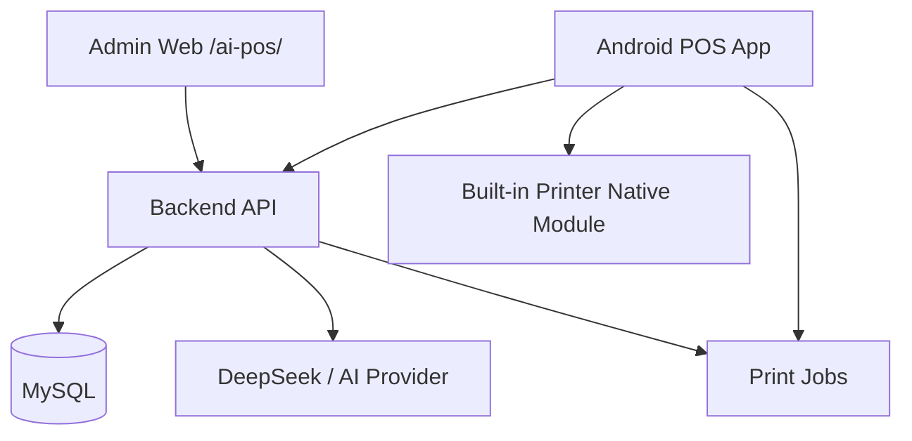
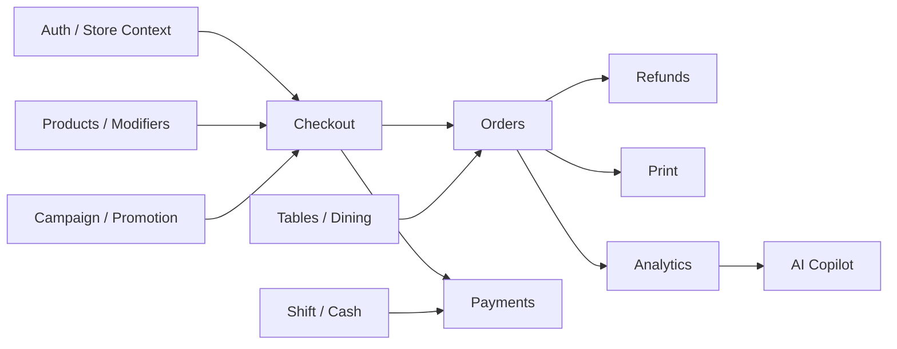
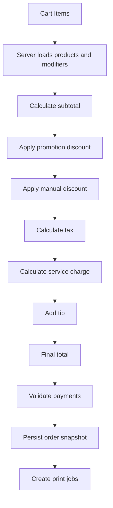
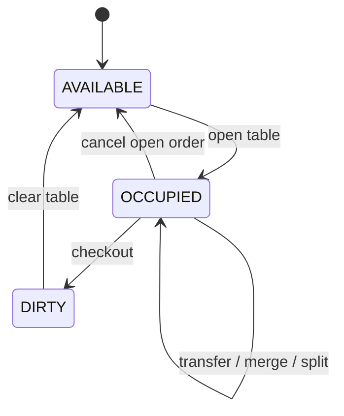
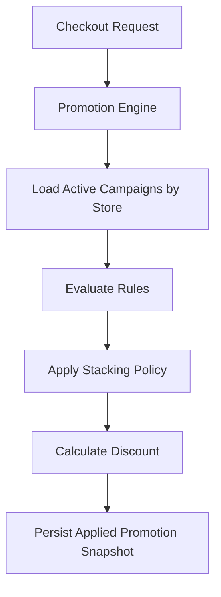
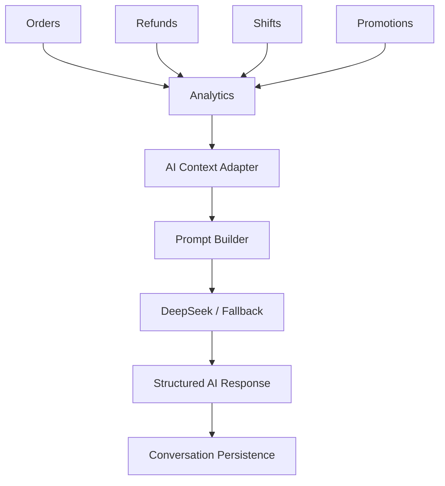

# AI-POS Overall Architecture

Last reviewed: 2026-07-20

This document records the current AI-POS architecture after the whole-project review. The project remains a modular monolith with three deployable surfaces:

- `ai-pos-server`: NestJS API, Prisma/ZenStack, MySQL, domain services.
- `ai-pos-admin`: Vite/React Admin under `/ai-pos/`.
- `ai-pos-app`: React Native Android POS app with native printer bridge.

The production preview paths are intentionally split:

- Admin: `http://49.235.186.154/ai-pos/`
- API: `http://49.235.186.154/ai-pos/api`
- Android API base: `http://49.235.186.154/ai-pos`

The Admin build must keep `VITE_API_BASE_URL=/ai-pos/api` and Vite `--base=/ai-pos/`. The Android app must keep the base without the trailing `/api` to avoid `/api/api`.

## Overall System Architecture

## Backend Domain Modules

## Checkout Amount Calculation Flow

## Table Post-pay Flow

## Promotion Engine Flow

## AI Analytics Flow

## Current Boundary Decisions

- Backend controllers are route and permission entry points; services still hold most orchestration.
- Store isolation is enforced by auth middleware, `StoreContextService`, and explicit `storeId` filters in services.
- RBAC is centralized with `RolesGuard` and route decorators.
- Checkout is the trusted money boundary. POS/Admin may preview totals, but persisted order totals are server recomputed.
- The Android printer bridge isolates vendor SDK calls from React Native screens and services.
- AI Copilot uses backend analytics evidence and bounded context slices; provider output does not own evidence numbers.

## Known Architecture Risks

- `checkout.service.ts`, `tables.service.ts`, `admin.service.ts`, `print.service.ts`, `SellScreen.tsx`, and `businessApi.ts` are large enough to slow future AI iteration.
- ZenStack model policies are permissive with `@@allow("all", true)`, so manual API routes must keep store filters correct.
- Some legacy nullable `storeId` fields remain on core models for early MVP compatibility.
- The root `scripts/check-architecture-boundaries.mjs` is useful but still shallow; it now recognizes newer modules, but does not yet enforce service size or money-boundary rules.
